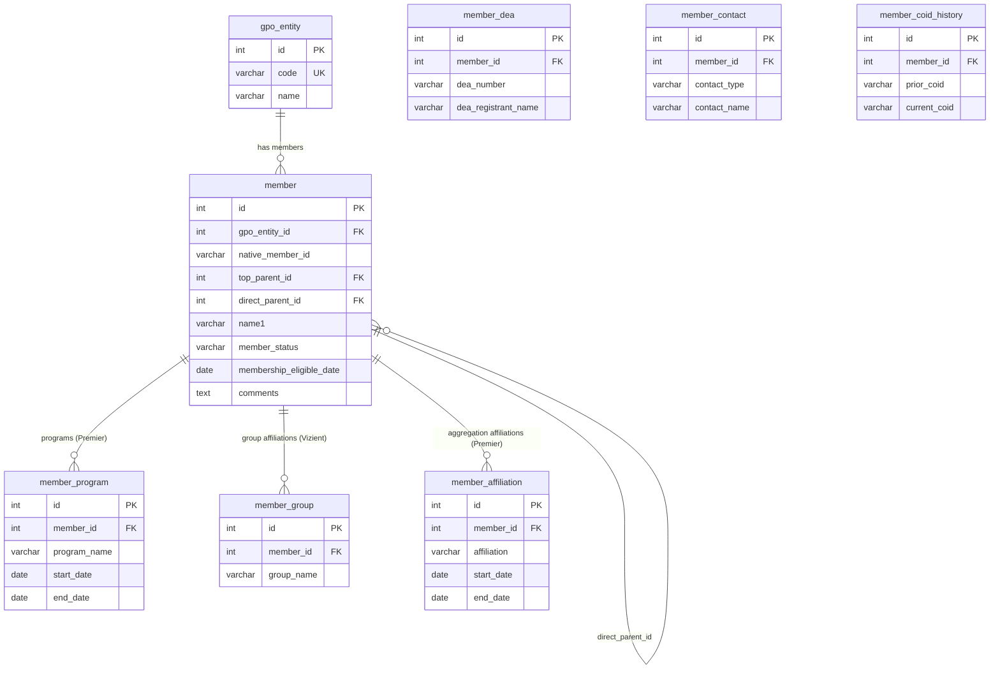

# GPO Data Model Documentation

## Overview

This document describes the normalized data model for ingesting and storing member data from three Group Purchasing Organizations (GPOs):

- **HealthTrust**
- **Premier**
- **Vizient**

Each GPO provides member data in different formats with different column structures. The model normalizes all three into a single shared schema, preventing duplicates and enabling cross-GPO reporting.

---

## Business Context

GPO member data is used to track healthcare facility memberships, hierarchy relationships, DEA registrations, contact information, and program eligibility. Each GPO has its own member identifier, hierarchy structure, and set of attributes. This model brings them together under a common structure while preserving GPO-specific details.

---

## Key Design Decisions

| Decision | Details |
|---|---|
| **One member table for all GPOs** | Members from all three GPOs live in the same `member` table, distinguished by `gpo_entity_id` |
| **Unique key per GPO** | `UNIQUE(gpo_entity_id, native_member_id)` prevents duplicate members within each GPO |
| **Self-referencing hierarchy** | Top Parents, Direct Parents, and Members are all rows in the same `member` table — parents reference themselves |
| **HealthTrust deduplication** | Source data has one row per DEA number per member. Rows are deduplicated on GPOID during ETL — DEA data is not loaded into the schema |

---

## Native Member Identifiers

Each GPO has its own unique member identifier that maps to `native_member_id` in the schema:

| GPO | Source Column | native_member_id |
|---|---|---|
| HealthTrust | GPOID | GPOID |
| Premier | Address ID | Address ID |
| Vizient | LIC | LIC (business-facing code) |

---

## Hierarchy Model

All three GPOs follow a maximum **3-level hierarchy**:

```
Top Parent
    └── Direct Parent
            └── Member
```

The hierarchy is stored using two self-referencing foreign keys on the `member` table:
- `top_parent_id` → points to the Top Parent member row
- `direct_parent_id` → points to the Direct Parent member row

### Hierarchy Level Detection Rule

| Condition | Member Role |
|---|---|
| `top_parent_id = direct_parent_id = self.id` | **Top Parent** (root node) |
| `top_parent_id = direct_parent_id ≠ self.id` | **Direct Parent** (2-level child) |
| `top_parent_id ≠ direct_parent_id` | **Leaf Member** (3-level) |

### Hierarchy Terminology by GPO

| Level | HealthTrust | Premier | Vizient |
|---|---|---|---|
| Top Parent | Top Parent GPOID | Top Parent GPO ID | System ID |
| Direct Parent | Direct Parent GPOID | Direct Parent GPO ID | Parent ID |
| Member | GPOID | Address ID | LIC |

---

## Data Load Order

Because parent rows must exist before child rows can reference them, data must be loaded in the following order:

| Pass | Level | Rule |
|---|---|---|
| **Pass 1** | Top Parents | `top_parent_id = direct_parent_id = own ID` |
| **Pass 2** | Direct Parents | `top_parent_id = direct_parent_id ≠ own ID` |
| **Pass 3** | Leaf Members | `top_parent_id ≠ direct_parent_id` |
| **Pass 4** | Child records | Programs (Premier), groups (Vizient), affiliations (Premier) |

---

## Tables

### `gpo_entity`
Registry of the three GPOs. Seeded with fixed values on setup.

| Column | Type | Description |
|---|---|---|
| id | INT | Primary key |
| code | VARCHAR | 'PREMIER', 'HEALTHTRUST', 'VIZIENT' |
| name | VARCHAR | Full GPO name |

---

### `member`
Core table. One row per unique member per GPO after deduplication.

| Column | Type | Source GPO | Description |
|---|---|---|---|
| id | INT | All | Primary key |
| gpo_entity_id | INT | All | FK to gpo_entity |
| native_member_id | VARCHAR | All | GPOID / Address ID / LIC |
| premier_gpo_id | VARCHAR | Premier | Premier GPO ID (secondary to Address ID) |
| vizient_member_id | VARCHAR | Vizient | Numeric Member ID (secondary to LIC) |
| name1 | VARCHAR | All | Primary name |
| name2 | VARCHAR | HT, Premier | Secondary name |
| override_name | VARCHAR | Premier | Override Name |
| address_type | VARCHAR | Premier | Address type |
| address1 | VARCHAR | All | Address line 1 |
| address2 | VARCHAR | All | Address line 2 |
| address3 | VARCHAR | HT, Premier | Address line 3 |
| city | VARCHAR | All | City |
| state | VARCHAR | All | State / Province |
| postal_code | VARCHAR | All | Postal / Zip Code |
| country | VARCHAR | HT, Premier | Country |
| top_parent_id | INT | All | FK → member (self-ref, top of hierarchy) |
| direct_parent_id | INT | All | FK → member (self-ref, direct parent) |
| relationship_to_top_parent | VARCHAR | Premier | Relationship to Top Parent |
| relationship_to_direct_parent | VARCHAR | Premier | Relationship to Direct Parent |
| member_status | VARCHAR | HT, Premier | Active / Inactive / etc. |
| membership_eligible_date | DATE | All | HT: Eligible Date / Premier: Start Date / Vizient: Member Date |
| committed_program_eligibility | VARCHAR | Premier | Committed program eligibility |
| supply_program | VARCHAR | Vizient | Supply program name |
| amc_tier_pricing | VARCHAR | Vizient | Academic Medical Center tier pricing |
| comments | TEXT | HealthTrust | Free-text comments |

---

### `member_program`
Stores named program enrollments with start and end dates. One row per program per member.

| Column | Type | Description |
|---|---|---|
| id | INT | Primary key |
| member_id | INT | FK → member |
| program_name | VARCHAR | 'AscenDrive', 'KIINDO', 'SURPASS' |
| start_date | DATE | Program start date |
| end_date | DATE | Program end date |

**Used by:** Premier only

---

### `member_group`
Stores multi-value group affiliations. One row per group per member.

| Column | Type | Description |
|---|---|---|
| id | INT | Primary key |
| member_id | INT | FK → member |
| group_name | VARCHAR | Group affiliation name |

**Used by:** Vizient (Vizient Group 1, Group 2, Group 3)

---

### `member_affiliation`
Stores aggregation affiliations with date ranges. One row per affiliation per member.

| Column | Type | Description |
|---|---|---|
| id | INT | Primary key |
| member_id | INT | FK → member |
| affiliation | VARCHAR | Affiliation name |
| start_date | DATE | Affiliation start date |
| end_date | DATE | Affiliation end date |

**Used by:** Premier (Aggregation Affiliation 1, 2, 3)

---

## Source Column Mapping Summary

### HealthTrust → Schema (17 columns)

| Source Column | Schema Table | Schema Column |
|---|---|---|
| GPOID | member | native_member_id |
| Membership Eligible Date | member | membership_eligible_date |
| Name1 | member | name1 |
| Name2 | member | name2 |
| Address1 | member | address1 |
| Address2 | member | address2 |
| Address3 | member | address3 |
| City | member | city |
| State/Province | member | state |
| Postal Code | member | postal_code |
| Country | member | country |
| Direct Parent GPOID | member | direct_parent_id (FK) |
| Direct Parent Name1 | *(on direct parent row)* | — |
| Top Parent GPOID | member | top_parent_id (FK) |
| Top Parent Name 1 | *(on top parent row)* | — |
| Member Status | member | member_status |
| Comments | member | comments |

### Premier → Schema (24 columns)

| Source Column | Schema Table | Schema Column |
|---|---|---|
| Address ID | member | native_member_id |
| GPO ID | member | premier_gpo_id |
| Membership Start Date | member | membership_eligible_date |
| Name 1 | member | name1 |
| Name 2 | member | name2 |
| Override Name | member | override_name |
| Address Type | member | address_type |
| Address 1 | member | address1 |
| Address 2 | member | address2 |
| Address 3 | member | address3 |
| City | member | city |
| State/Province | member | state |
| Postal Code | member | postal_code |
| Country | member | country |
| Relationship to Top Parent | member | relationship_to_top_parent |
| Relationship to Direct Parent | member | relationship_to_direct_parent |
| Direct Parent GPO ID | member | direct_parent_id (FK) |
| Direct Parent Name 1 | *(on direct parent row)* | — |
| Top Parent GPO ID | member | top_parent_id (FK) |
| Top Parent Name 1 | *(on top parent row)* | — |
| Member Status | member | member_status |
| Committed Program Eligibility | member | committed_program_eligibility |
| AscenDrive Start/End Date | member_program | program_name='AscenDrive', start_date, end_date |
| KIINDO Start/End Date | member_program | program_name='KIINDO', start_date, end_date |
| SURPASS Start/End Date | member_program | program_name='SURPASS', start_date, end_date |
| Aggregation Affiliation 1/2/3 + Start/End Dates | member_affiliation | affiliation, start_date, end_date |

### Vizient → Schema (18 columns)

| Source Column | Schema Table | Schema Column |
|---|---|---|
| LIC | member | native_member_id |
| Member ID | member | vizient_member_id |
| Member Date | member | membership_eligible_date |
| Member Name | member | name1 |
| Address1 | member | address1 |
| Address2 | member | address2 |
| City | member | city |
| State | member | state |
| Zip Code | member | postal_code |
| System ID | member | top_parent_id (FK) |
| System Name | *(on top parent row)* | — |
| Parent ID | member | direct_parent_id (FK) |
| Parent Name | *(on direct parent row)* | — |
| Supply Program | member | supply_program |
| AMC Tier Pricing | member | amc_tier_pricing |
| Vizient Group 1 | member_group | group_name |
| Vizient Group 2 | member_group | group_name |
| Vizient Group 3 | member_group | group_name |

---

## Entity Relationship Diagram



---

## Child Tables by GPO

| Table | HealthTrust | Premier | Vizient |
|---|---|---|---|
| member_program | — | AscenDrive, KIINDO, SURPASS | — |
| member_group | — | — | Vizient Group 1/2/3 |
| member_affiliation | — | Aggregation Affiliation 1/2/3 | — |

---

## Files in Repository

| File | Description |
|---|---|
| `schema.sql` | Full DDL — CREATE TABLE statements, indexes, hierarchy view |
| `hierarchy_load_queries.sql` | 3-pass SELECT queries for loading each GPO in correct hierarchy order |
| `data_model.md` | ERD diagram and column mapping reference |
| `GPO_Data_Model_Documentation.md` | This document |

---

## Glossary

| Term | Definition |
|---|---|
| GPO | Group Purchasing Organization |
| GPOID | HealthTrust's unique member identifier |
| LIC | Vizient's business-facing member code |
| Address ID | Premier's unique member location identifier |
| COID | HealthTrust internal ID — not unique, changes over time |
| DEA | Drug Enforcement Administration registration number |
| HRSA / 340B | Health Resources & Services Administration drug pricing program |
| DSH | Disproportionate Share Hospital |
| GLN | Global Location Number — international location standard |
| HIN | Health Industry Number |
| Top Parent | Root node of the member hierarchy — references itself |
| Direct Parent | Mid-level node sitting between Top Parent and leaf Member |
| native_member_id | The GPO's own unique identifier for a member, used as the natural key |
