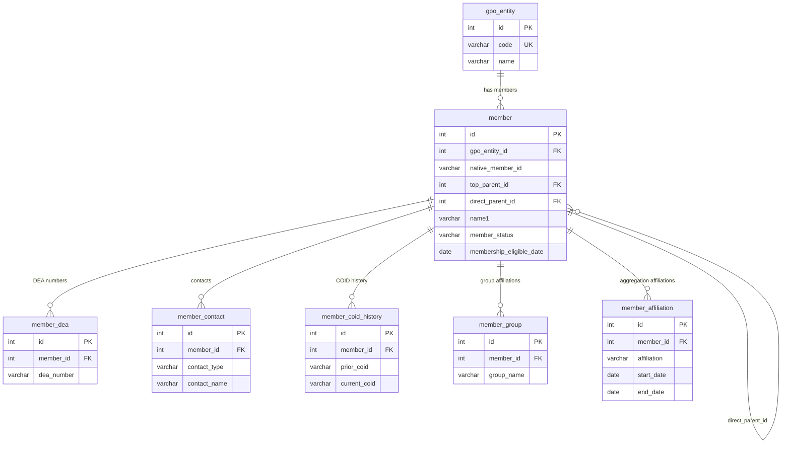

# GPO Data Model Documentation

## Overview

This document describes the normalized data model for ingesting and storing member data from three Group Purchasing Organizations (GPOs):

- **HealthTrust**
- **Premier**
- **Vizient**

Each GPO provides member data in different formats with different column structures. The model normalizes all three into a single shared schema, preventing duplicates and enabling cross-GPO reporting.

---

## Business Context

GPO member data is used to track healthcare facility memberships, hierarchy relationships, DEA registrations, contact information, and program eligibility. Each GPO has its own member identifier, hierarchy structure, and set of attributes. This model brings them together under a common structure while preserving GPO-specific details.

---

## Key Design Decisions

| Decision | Details |
|---|---|
| **One member table for all GPOs** | Members from all three GPOs live in the same `member` table, distinguished by `gpo_entity_id` |
| **Unique key per GPO** | `UNIQUE(gpo_entity_id, native_member_id)` prevents duplicate members within each GPO |
| **Self-referencing hierarchy** | Top Parents, Direct Parents, and Members are all rows in the same `member` table — parents reference themselves |
| **HealthTrust deduplication** | Source data has one row per DEA number per member. DEA numbers are moved to a child table (`member_dea`) to eliminate duplicate member rows |
| **COID is not unique (HealthTrust)** | COID changes over time. GPOID is the stable key. Prior COID history is preserved in `member_coid_history` |

---

## Native Member Identifiers

Each GPO has its own unique member identifier that maps to `native_member_id` in the schema:

| GPO | Source Column | native_member_id |
|---|---|---|
| HealthTrust | GPOID | GPOID |
| Premier | Address ID | Address ID |
| Vizient | LIC | LIC (business-facing code) |

---

## Hierarchy Model

All three GPOs follow a maximum **3-level hierarchy**:

```
Top Parent
    └── Direct Parent
            └── Member
```

The hierarchy is stored using two self-referencing foreign keys on the `member` table:
- `top_parent_id` → points to the Top Parent member row
- `direct_parent_id` → points to the Direct Parent member row

### Hierarchy Level Detection Rule

| Condition | Member Role |
|---|---|
| `top_parent_id = direct_parent_id = self.id` | **Top Parent** (root node) |
| `top_parent_id = direct_parent_id ≠ self.id` | **Direct Parent** (2-level child) |
| `top_parent_id ≠ direct_parent_id` | **Leaf Member** (3-level) |

### Hierarchy Terminology by GPO

| Level | HealthTrust | Premier | Vizient |
|---|---|---|---|
| Top Parent | Top Parent GPOID | Top Parent GPO ID | System ID |
| Direct Parent | Direct Parent GPOID | Direct Parent GPO ID | Parent ID |
| Member | GPOID | Address ID | LIC |

---

## Data Load Order

Because parent rows must exist before child rows can reference them, data must be loaded in the following order:

| Pass | Level | Rule |
|---|---|---|
| **Pass 1** | Top Parents | `top_parent_id = direct_parent_id = own ID` |
| **Pass 2** | Direct Parents | `top_parent_id = direct_parent_id ≠ own ID` |
| **Pass 3** | Leaf Members | `top_parent_id ≠ direct_parent_id` |
| **Pass 4** | Child records | DEA numbers, contacts, COID history, groups, affiliations |

---

## Tables

### `gpo_entity`
Registry of the three GPOs. Seeded with fixed values on setup.

| Column | Type | Description |
|---|---|---|
| id | INT | Primary key |
| code | VARCHAR | 'PREMIER', 'HEALTHTRUST', 'VIZIENT' |
| name | VARCHAR | Full GPO name |

---

### `member`
Core table. One row per unique member per GPO after deduplication.

**Key columns:**

| Column | Type | Source GPO | Description |
|---|---|---|---|
| id | INT | All | Primary key |
| gpo_entity_id | INT | All | FK to gpo_entity |
| native_member_id | VARCHAR | All | GPOID / Address ID / LIC |
| premier_gpo_id | VARCHAR | Premier | Premier GPO ID (secondary to Address ID) |
| vizient_member_id | VARCHAR | Vizient | Numeric Member ID (secondary to LIC) |
| current_coid | VARCHAR | HealthTrust | Current COID (not unique, changes over time) |
| ccn | VARCHAR | HealthTrust | CMS Certification Number |
| name1 | VARCHAR | All | Primary name |
| name2 | VARCHAR | HT, Premier | Secondary name |
| override_name | VARCHAR | Premier | Override Name |
| address_type | VARCHAR | HT, Premier | Address type |
| address1–3 | VARCHAR | All | Street address lines |
| city, state, postal_code, country | VARCHAR | All | Location fields |
| phone, fax | VARCHAR | HealthTrust | Contact numbers |
| top_parent_id | INT | All | FK → member (self-ref, top of hierarchy) |
| direct_parent_id | INT | All | FK → member (self-ref, direct parent) |
| relationship_to_gpo | VARCHAR | HealthTrust | Member's relationship to the GPO |
| relationship_to_top_parent | VARCHAR | Premier | Relationship to Top Parent |
| relationship_to_direct_parent | VARCHAR | HT, Premier | Relationship to Direct Parent |
| member_status | VARCHAR | HT, Premier | Active / Inactive / etc. |
| membership_eligible_date | DATE | All | HT: Eligible Date / Premier: Start Date / Vizient: Member Date |
| membership_ineligible_date | DATE | HealthTrust | Date membership ended |
| org_status | VARCHAR | HealthTrust | Organizational status |
| committed_program_eligibility | VARCHAR | Premier | Committed program eligibility |
| class_of_trade | VARCHAR | HealthTrust | Class of trade classification |
| facility_type | VARCHAR | HealthTrust | Type of facility |
| licensed_beds | INT | HealthTrust | Number of licensed beds |
| company_name | VARCHAR | HealthTrust | Company name |
| group_name | VARCHAR | HealthTrust | Group name |
| division | VARCHAR | HealthTrust | Division |
| market | VARCHAR | HealthTrust | Market |
| pharmacy_eligible_date | DATE | HealthTrust | Pharmacy program start |
| pharmacy_ineligible_date | DATE | HealthTrust | Pharmacy program end |
| non_pharmacy_eligible_date | DATE | HealthTrust | Non-pharmacy program start |
| non_pharmacy_ineligible_date | DATE | HealthTrust | Non-pharmacy program end |
| hrsa_flag | BOOLEAN | HealthTrust | HRSA (340B) eligible flag |
| hrsa_number | VARCHAR | HealthTrust | HRSA number |
| hrsa_eligible_date | DATE | HealthTrust | HRSA eligibility start |
| hrsa_ineligible_date | DATE | HealthTrust | HRSA eligibility end |
| dsh_flag | BOOLEAN | HealthTrust | Disproportionate Share Hospital flag |
| advantage_trust_flag | BOOLEAN | HealthTrust | AdvantageTrust flag |
| supply_program | VARCHAR | Vizient | Supply program name |
| amc_tier_pricing | VARCHAR | Vizient | Academic Medical Center tier pricing |
| comments | TEXT | HealthTrust | Free-text comments |

---

### `member_dea`
Stores DEA registrations. One row per DEA number per member.

> **Note:** HealthTrust source data contains one row per DEA number per member, causing apparent duplicates. Moving DEA numbers to this child table eliminates those duplicates in the `member` table.

| Column | Type | Description |
|---|---|---|
| id | INT | Primary key |
| member_id | INT | FK → member |
| dea_number | VARCHAR | DEA registration number |
| dea_registrant_name | VARCHAR | Name on DEA registration |

**Used by:** HealthTrust, Premier

---

### `member_contact`
Stores named contacts for a member. One row per contact type per member.

| Column | Type | Description |
|---|---|---|
| id | INT | Primary key |
| member_id | INT | FK → member |
| contact_type | VARCHAR | 'Director of Pharmacy', 'Material Manager' |
| contact_name | VARCHAR | Full name |
| phone | VARCHAR | Phone number |
| fax | VARCHAR | Fax number |
| email | VARCHAR | Email address |

**Used by:** HealthTrust

---

### `member_coid_history`
Tracks COID changes over time for HealthTrust members.

> **Note:** COID is not a stable unique identifier — it can change over time. GPOID is the stable key. This table preserves the audit trail of Prior COID → current COID transitions.

| Column | Type | Description |
|---|---|---|
| id | INT | Primary key |
| member_id | INT | FK → member |
| prior_coid | VARCHAR | Previous COID value |
| current_coid | VARCHAR | New COID value |
| effective_date | DATE | Date of transition (if known) |
| recorded_at | TIMESTAMP | When this record was created |

**Used by:** HealthTrust only

---

### `member_group`
Stores multi-value group affiliations. One row per group per member.

| Column | Type | Description |
|---|---|---|
| id | INT | Primary key |
| member_id | INT | FK → member |
| group_name | VARCHAR | Group affiliation name |

**Used by:** Vizient (Vizient Group 1, Group 2, Group 3)

---

### `member_affiliation`
Stores aggregation affiliations with date ranges. One row per affiliation per member.

| Column | Type | Description |
|---|---|---|
| id | INT | Primary key |
| member_id | INT | FK → member |
| affiliation | VARCHAR | Affiliation name |
| start_date | DATE | Affiliation start date |
| end_date | DATE | Affiliation end date |

**Used by:** Premier (Aggregation Affiliation 1, 2, 3)

---

## Source Column Mapping Summary

### HealthTrust → Schema

| Source Column | Schema Table | Schema Column |
|---|---|---|
| GPOID | member | native_member_id |
| COID | member | current_coid |
| Prior COID | member_coid_history | prior_coid / current_coid |
| Name1, Name2 | member | name1, name2 |
| Address1/2/3, City, State, Postal Code | member | address1–3, city, state, postal_code |
| Phone, Fax | member | phone, fax |
| Top Parent GPOID | member | top_parent_id (FK) |
| Direct Parent GPOID | member | direct_parent_id (FK) |
| Member Status | member | member_status |
| Membership Eligible Date | member | membership_eligible_date |
| Class of Trade | member | class_of_trade |
| Facility Type | member | facility_type |
| Licensed Beds | member | licensed_beds |
| Company Name | member | company_name |
| Group | member | group_name |
| HRSA (flag) | member | hrsa_flag |
| HRSA Number | member | hrsa_number |
| DSH Flag | member | dsh_flag |
| DEA Number, DEA Name | member_dea | dea_number, dea_registrant_name |
| Director of Pharmacy / Phone / Fax | member_contact | contact_name / phone / fax |
| Material Manager / Phone / Fax | member_contact | contact_name / phone / fax |

### Premier → Schema

| Source Column | Schema Table | Schema Column |
|---|---|---|
| Address ID | member | native_member_id |
| GPO ID | member | premier_gpo_id |
| Name 1, Name 2 | member | name1, name2 |
| Override Name | member | override_name |
| Address Type | member | address_type |
| Address 1/2/3, City, State/Province, Postal Code | member | address fields |
| Top Parent GPO ID | member | top_parent_id (FK) |
| Direct Parent GPO ID | member | direct_parent_id (FK) |
| Relationship to Top Parent | member | relationship_to_top_parent |
| Relationship to Direct Parent | member | relationship_to_direct_parent |
| Member Status | member | member_status |
| Membership Start Date | member | membership_eligible_date |
| Committed Program Eligibility | member | committed_program_eligibility |
| DEA # | member_dea | dea_number |
| Aggregation Affiliation 1/2/3 + Start/End Dates | member_affiliation | affiliation, start_date, end_date |

### Vizient → Schema

| Source Column | Schema Table | Schema Column |
|---|---|---|
| LIC | member | native_member_id |
| Member ID | member | vizient_member_id |
| Member Name | member | name1 |
| Member Date | member | membership_eligible_date |
| Address1/2, City, State, Zip Code | member | address fields |
| System ID | member | top_parent_id (FK) |
| Parent ID | member | direct_parent_id (FK) |
| Supply Program | member | supply_program |
| AMC Tier Pricing | member | amc_tier_pricing |
| Vizient Group 1/2/3 | member_group | group_name |

---

## Entity Relationship Diagram



---

## Files in Repository

| File | Description |
|---|---|
| `schema.sql` | Full DDL — CREATE TABLE statements, indexes, hierarchy view |
| `hierarchy_load_queries.sql` | 3-pass SELECT queries for loading each GPO in correct hierarchy order |
| `data_model.md` | ERD diagram and column mapping reference |
| `GPO_Data_Model_Documentation.md` | This document |

---

## Glossary

| Term | Definition |
|---|---|
| GPO | Group Purchasing Organization |
| GPOID | HealthTrust's unique member identifier |
| LIC | Vizient's business-facing member code |
| Address ID | Premier's unique member location identifier |
| COID | HealthTrust internal ID — not unique, changes over time |
| DEA | Drug Enforcement Administration registration number |
| HRSA / 340B | Health Resources & Services Administration drug pricing program |
| DSH | Disproportionate Share Hospital |
| GLN | Global Location Number — international location standard |
| HIN | Health Industry Number |
| Top Parent | Root node of the member hierarchy — references itself |
| Direct Parent | Mid-level node sitting between Top Parent and leaf Member |
| native_member_id | The GPO's own unique identifier for a member, used as the natural key |
