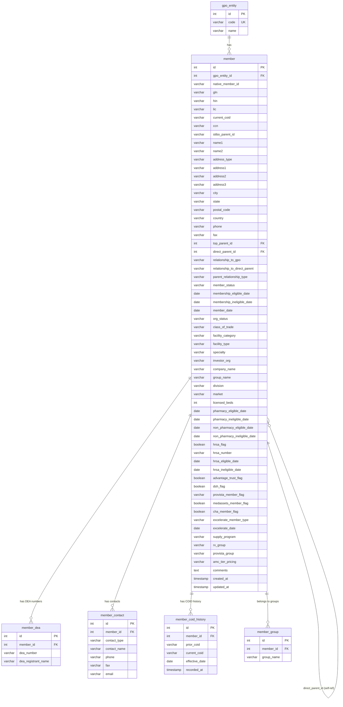

# GPO Data Model — Entity Relationship Diagram

## Hierarchy Rules

| Condition | Member Role |
|---|---|
| `top_parent_id = direct_parent_id = self.id` | **Top Parent** (root node) |
| `top_parent_id = direct_parent_id ≠ self.id` | **Direct child of top** (2-level) |
| `top_parent_id ≠ direct_parent_id ≠ self.id` | **Leaf Member** (3-level) |

## GPO Native Member ID

| GPO | native_member_id source | Unique? |
|---|---|---|
| HealthTrust | GPOID | Yes (after dedup) |
| Premier | Address ID | Yes |
| Vizient | LIC | Yes (business-facing identifier) |

## Child Tables by GPO

| Table | HealthTrust | Premier | Vizient |
|---|---|---|---|
| member_dea | Yes (DEA Number) | — | — |
| member_contact | Director of Pharmacy, Material Manager | — | Account Manager |
| member_coid_history | Yes (Prior COID) | — | — |
| member_group | — | — | Yes (Group 1/2/3) |
