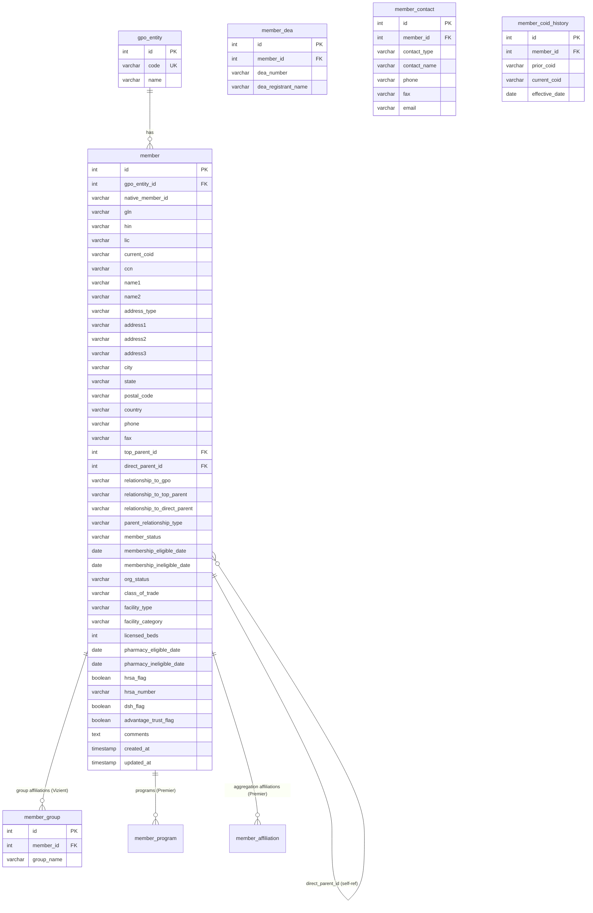

# GPO Data Model — Entity Relationship Diagram

---

## Hierarchy Rules

| Condition | Member Role |
|---|---|
| `top_parent_id = direct_parent_id = self.id` | **Top Parent** (root node) |
| `top_parent_id = direct_parent_id != self.id` | **Direct child of top** (2-level) |
| `top_parent_id != direct_parent_id != self.id` | **Leaf Member** (3-level) |

---

## Native Member ID by GPO

| GPO | native_member_id | Unique? |
|---|---|---|
| HealthTrust | GPOID | Yes (after dedup) |
| Premier | Address ID | Yes |
| Vizient | LIC | Yes |

---

## Column Mapping by GPO

### Core member fields

| Schema Column | HealthTrust Source | Premier Source | Vizient Source |
|---|---|---|---|
| native_member_id | GPOID | Address ID | LIC |
| premier_gpo_id | — | GPO ID | — |
| gln | GLN | — | GLN |
| hin | Health Industry Number (HIN) | — | HIN |
| current_coid | COID | — | — |
| ccn | CCN | — | — |
| lic | — | — | LIC |
| name1 | Name1 | Name 1 | Member Name |
| name2 | Name2 | Name 2 | — |
| address_type | Address Type | Address Type | — |
| address1–3 | Address1/2/3 | Address 1/2/3 | Address1 |
| city | City | City | City |
| state | State | State/Province | State |
| postal_code | Postal Code | Postal Code | Zip Code |
| country | Country | — | — |
| phone | Phone | — | Member Phone |
| fax | Fax | — | — |
| top_parent_id | Top Parent GPOID | Top Parent GPO ID | System ID |
| direct_parent_id | Direct Parent GPOID | Direct Parent GPO ID | Parent ID |
| relationship_to_gpo | Relationship to GPO | — | — |
| relationship_to_top_parent | — | Relationship to Top Parent | — |
| relationship_to_direct_parent | Relationship to Direct Parent | Relationship to Direct Parent | — |
| member_status | Member Status | Member Status | — |
| membership_eligible_date | Membership Eligible Date | Membership Start Date | Member Date |
| membership_ineligible_date | Membership Ineligible Date | — | — |
| org_status | Organizational Status | — | — |
| class_of_trade | Class of Trade | — | — |
| facility_type | Facility Type | — | Facility Type |
| facility_category | — | — | Facility Category |
| licensed_beds | Licensed Beds | — | — |
| pharmacy_eligible_date | Pharmacy Eligible Date | — | — |
| pharmacy_ineligible_date | Pharmacy InEligible Date | — | — |
| hrsa_flag | HRSA | — | — |
| hrsa_number | HRSA Number | — | — |
| hrsa_eligible_date | HRSA Eligible Date | — | — |
| hrsa_ineligible_date | HRSA InEligible Date | — | — |
| dsh_flag | DSH Flag | — | — |
| advantage_trust_flag | AdvantageTrust | — | — |
| provista_member_flag | — | — | Provista Member |
| excelerate_member_type | — | — | Excelerate Member |
| supply_program | — | — | Supply Program |
| rx_group | — | — | Rx Group |
| amc_tier_pricing | — | — | AMC Tier Pricing |
| comments | Comments | — | — |

---

## Child Tables by GPO

| Table | HealthTrust | Premier | Vizient |
|---|---|---|---|
| member_program | — | AscenDrive, KIINDO, SURPASS | — |
| member_group | — | — | Vizient Group 1/2/3 |
| member_affiliation | — | Aggregation Affiliation 1/2/3 | — |

---

## Load Order (all GPOs)

1. **Pass 1** — Top Parents (`top_parent_id = direct_parent_id = self`)
2. **Pass 2** — Direct Parents (`direct_parent_id = top_parent_id != self`)
3. **Pass 3** — Leaf Members (`direct_parent_id != top_parent_id`)
4. **Pass 4** — Child records (DEA, contacts, COID history, groups)
